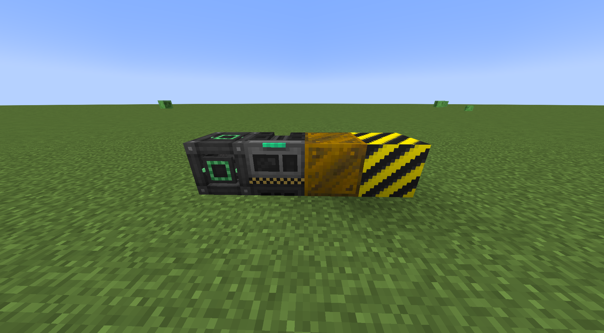
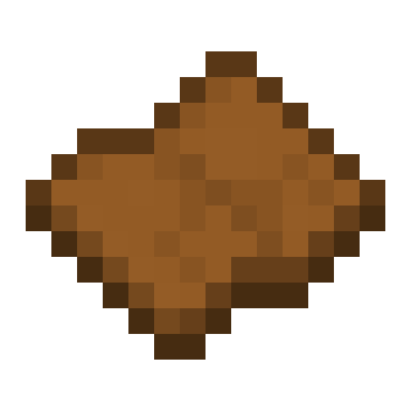
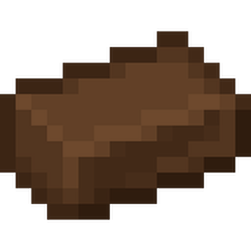

# BlockMod - A Minecraft Mod for NeoForge

{: width="100"}

Adds new wood-based materials and integration with Mekanism. Features two new creative tabs for organization and seamless building blocks.

## Showcase
{: width="600"}

## Key Features

### 🪵 Wood Sheets
{: width="32"}
- **Obtained by**: 
  - Crafting recipes
  - Chopping wood (modified vanilla loot tables)
- **Primary use**: Base material for advanced components

### 🔥 Hard Wood
{: width="32"}
- Created by smelting Wood Sheets
- **Uses**:
  1. Crafted into Hard Wood Blocks (2x2 pattern)
  2. Processed into Hardwood Alloy

### ⚙️ Hardwood Alloy
{: width="32"}
- Created in Mekanism's **Metallurgic Infuser**:
  - Input: Hard Wood + Carbon (coal/charcoal)
- **Purpose**: High-strength material for tools and machines

### 🏗️ Building Blocks
1. **Hard Wood Block**:
   - Crafted from 4 Hard Wood (2x2 pattern)
   - Textured seamless edges
   
2. **Hazard Block**:
   - Decorative block with warning styling
   - Seamless edge design

*(Both blocks visible in Showcase image above)*

### 📦 Creative Tabs
1. **Wood Items Tab**: Contains all wood-based items
2. **Building Blocks Tab**: Includes Hard Wood Block and Hazard Block

---

## Installation

1. **Clone this template** using [GitHub's template feature](https://docs.github.com/en/repositories/creating-and-managing-repositories/creating-a-repository-from-a-template)
   
2. **Open in IDE** (IntelliJ or Eclipse recommended)

3. **Resolve dependencies**:
   ```shell
   ./gradlew --refresh-dependencies
   ./gradlew clean
